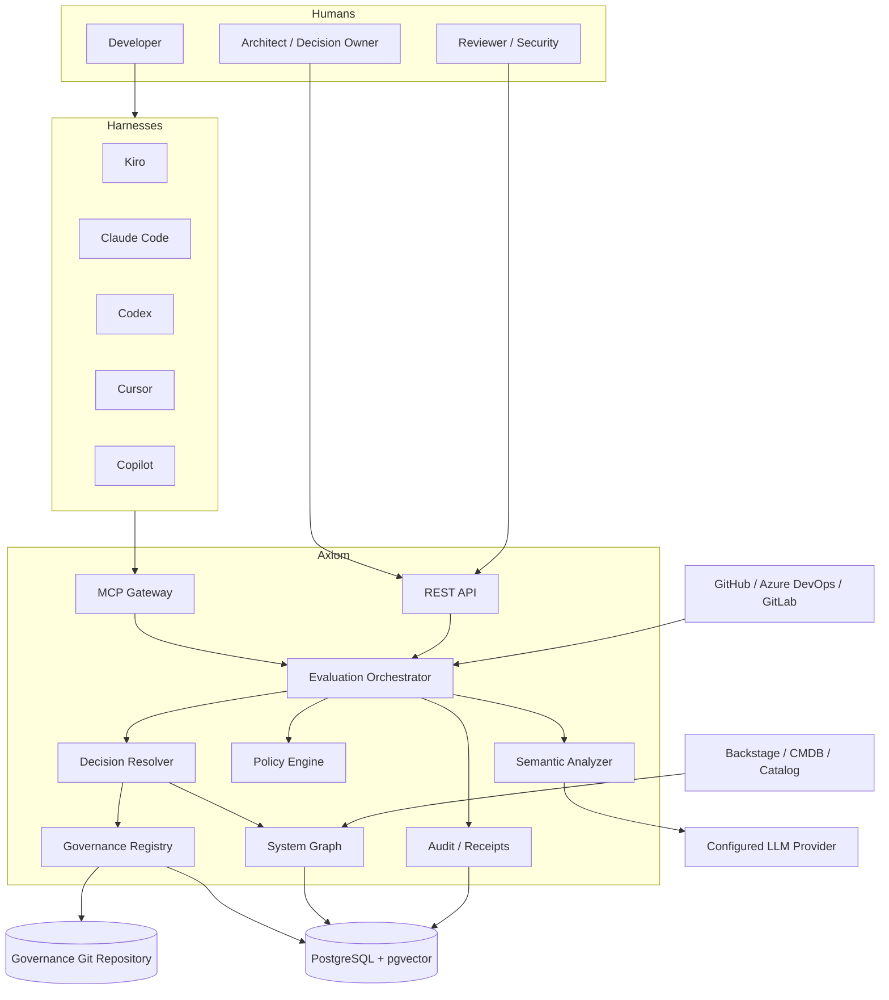
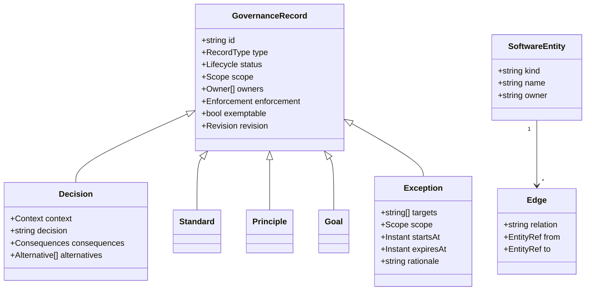
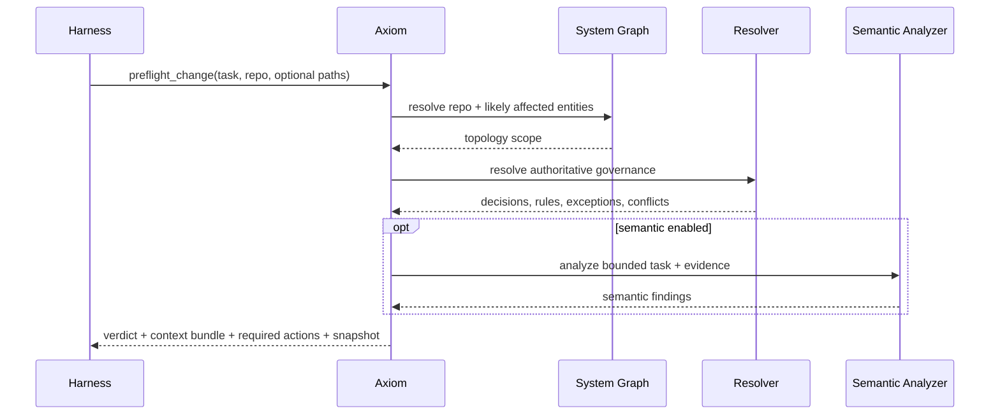

# Axiom Technical Design

## 1. Overview

Axiom is an Engineering Governance Plane that sits between organizational engineering knowledge and the tools that change software. It does not generate code itself. It makes accepted decisions, standards, goals, topology, and exceptions **queryable, scoped, explainable, and enforceable**.

The design intentionally separates four concerns that are often incorrectly collapsed into one “RAG assistant”:

1. **Authority** — what the organization has actually decided.
2. **Topology** — what software entities exist and how they depend on one another.
3. **Resolution** — which decisions apply to this exact task/change.
4. **Evaluation** — whether the proposed/actual change complies.

## 2. Design goals

- Vendor-neutral agent integration.
- Multi-repository and multi-system awareness.
- Git-backed authoritative governance.
- Deterministic enforcement wherever possible.
- Semantic assistance only where deterministic checks are insufficient.
- Strong human authority boundaries.
- Reproducible evaluations and audit receipts.
- Low-context, scope-first retrieval.
- Progressive adoption without requiring an all-at-once platform migration.
- Ability to operate without Backstage while integrating with it cleanly.

## 3. System context



## 4. Container architecture

### 4.1 Axiom API/MCP host
Stateless horizontally scalable host.

Responsibilities:
- OIDC authentication and request identity.
- REST and MCP transports.
- Request validation.
- Rate limiting.
- Dispatch into application use cases.
- Streaming long-running evaluations where useful.

### 4.2 Governance Registry
Responsibilities:
- Parse/validate governance Git records.
- Lifecycle rules.
- Ownership.
- Revision identities.
- Relationship graph between governance records.
- Source-to-projection synchronization.
- Freshness metadata.
- Change event emission.

Authoritative writes occur via Git workflow:
- API/portal creates branch/commit/PR or pushes through an authorized Git integration.
- Approval/merge is the authoritative transition.
- Projection worker observes merged Git state and indexes it.

### 4.3 System Graph
Represents:
- Organization
- Domain
- System
- Component
- Repository
- API
- Resource
- Queue/Event Stream
- Database/Data Product
- Deployment
- Team/Owner
- Capability

Edges include:
- `CONTAINS`
- `OWNS`
- `IMPLEMENTS`
- `PROVIDES`
- `CONSUMES`
- `DEPENDS_ON`
- `PUBLISHES_TO`
- `SUBSCRIBES_TO`
- `STORES_IN`
- `DEPLOYED_AS`
- `GOVERNED_BY`

The first implementation uses PostgreSQL relational tables + recursive CTEs. A graph database is optional later if topology queries prove cumbersome or too slow.

### 4.4 Decision Resolver
Pure/domain-oriented resolution pipeline.

Inputs:
- task text;
- repo/ref;
- optional file paths;
- optional design;
- actual diff when available;
- actor/harness;
- environment/change class.

Stages:
1. Resolve repository identity.
2. Resolve direct components/systems/capabilities.
3. Traverse bounded topology impact.
4. Select active governance records by explicit scope.
5. Apply specificity and precedence.
6. Apply active exceptions.
7. Detect authoritative conflicts.
8. Add semantic candidates only after deterministic scope.
9. Build minimal context bundle.
10. Produce a resolution trace.

### 4.5 Policy Engine
Two classes:

**Built-in trusted rules**
- dependency direction;
- forbidden package/import;
- file placement;
- schema/versioning checks;
- required metadata;
- API breaking-change checks;
- repo convention checks;
- secret/config checks;
- required test presence;
- deployment security checks.

**Custom rules**
- organization-owned plugins executed in a constrained policy runner.
- versioned and hashed.
- explicit inputs and outputs.
- no arbitrary production credentials.
- time/memory/network limits.

### 4.6 Semantic Analyzer
Used for:
- intent vs accepted decision conflicts;
- duplicate solution detection;
- ambiguous ownership;
- architectural smell relative to rationale;
- proposed design contradiction;
- candidate ADR extraction;
- “this looks like a new architectural decision” detection.

It receives a bounded evidence packet, not the entire organization corpus.

Output is typed:

```json
{
  "findingType": "potential_conflict",
  "severity": "require_review",
  "confidence": 0.86,
  "governanceIds": ["ARCH-042"],
  "claim": "The design moves role-specific routing into the gateway.",
  "evidence": [
    {"source": "design", "locator": "section:Proposed Flow"},
    {"source": "decision", "id": "ARCH-042", "revision": "7"}
  ],
  "recommendedAction": "Keep role-based resolution in Homepage Service or request an exception."
}
```

The model cannot mutate authority.

### 4.7 Evaluation Orchestrator
Coordinates evaluations at stages:

- `PRE_FLIGHT`
- `DESIGN`
- `EDIT_CHECK`
- `DIFF`
- `PR`
- `DRIFT`

Verdict lattice:

```text
ALLOW
  < ALLOW_WITH_WARNINGS
  < REQUIRE_REVIEW
  < BLOCK
```

The most restrictive non-waived result wins.

### 4.8 Audit/Receipt service
Every material evaluation stores:
- immutable evaluation ID;
- request fingerprint;
- actor/harness;
- SCM coordinates;
- governance snapshot hash;
- applicable record IDs + revisions;
- exception IDs + revisions;
- policy versions;
- semantic provider/model metadata;
- findings;
- verdict;
- timing;
- evidence hashes.

Receipts are append-only from the application perspective.

## 5. Canonical domain model



## 6. Governance record precedence

Precedence is not “which vector result is most similar”.

Evaluation order:

1. **Non-exemptable hard controls**.
2. **Valid explicit exceptions** for exemptable controls.
3. **More-specific accepted records** over less-specific records when semantics are compatible.
4. **Accepted decisions/invariants/standards**.
5. **Organization principles/goals**.
6. **Advisory guidance**.
7. **Inferred/candidate knowledge** — never authoritative.

If two accepted records at equivalent authority/specificity conflict:
- return `REQUIRE_REVIEW`;
- if a hard gate requires a single answer, return `BLOCK` with reason `UNRESOLVED_AUTHORITY_CONFLICT`;
- never ask the LLM to silently choose one.

## 7. Scope specificity

A match receives a deterministic specificity tuple, for example:

```text
tenant
domain
system
component
repository
path
capability
technology
environment
changeClass
```

An exact repository/path rule is more specific than an organization-wide generic standard. Specificity can refine a broader rule only when:
- the broader rule is exemptable/refinable;
- the specific record explicitly declares the relationship or compatible refinement;
- no non-exemptable control is weakened.

## 8. Evaluation workflows

### 8.1 Preflight



### 8.2 Design
A significant change must submit a design containing:
- goal;
- non-goals;
- affected systems;
- current behavior;
- proposed behavior;
- data/control flow;
- contracts;
- security/privacy;
- failure modes;
- observability;
- migration/rollout;
- decisions consulted;
- new decision candidates.

Design validation checks:
- mandatory fields;
- applicable records acknowledged;
- contradictions;
- unowned dependencies;
- new architecture decisions not recorded;
- rollout/compatibility obligations.

### 8.3 Diff
The actual diff is authoritative over planned file scope.

Diff validator:
1. parses changed files;
2. recomputes affected scope;
3. identifies scope expansion;
4. runs deterministic rules;
5. maps code evidence to decisions;
6. optionally compares design intent to implementation;
7. invalidates stale approval if necessary.

### 8.4 PR gate
CI calls Axiom with immutable commit SHA. Axiom re-evaluates independent of local agent state.

Merge allowed if:
- no blocking deterministic violations;
- required review approvals satisfied;
- no expired/missing exception;
- design is current for significant changes;
- receipt generated for the exact SHA.

## 9. Significant-change classifier

A change requires formal design if any configured trigger is true:

- new service/component/API/queue/database;
- cross-system dependency;
- auth/security boundary change;
- data ownership/storage model change;
- public contract change;
- infrastructure/deployment topology change;
- introduction/removal of strategic technology;
- migration;
- high-risk package/provider;
- touching N+ systems/repositories;
- explicit decision-owner policy;
- semantic classifier proposes “architectural decision likely”.

Classifier output is explainable and can be overridden by an authorized reviewer.

## 10. Repository bootstrap

Repositories contain a small portable `AGENTS.md`:

```md
Before planning or implementing a non-trivial change:
1. Call Axiom preflight.
2. Read REQUIRED governance items.
3. For significant changes, produce/validate a design before editing.
4. If Axiom returns BLOCK, do not proceed.
5. If it returns REQUIRE_REVIEW, do not represent the issue as resolved.
6. After edits, validate the diff.
```

Tool-specific files only teach the harness how to call the same central contract.

## 11. MCP tools

Canonical tool set:

- `governance.preflight_change`
- `governance.get_context`
- `governance.query_decisions`
- `governance.impact_analysis`
- `governance.validate_design`
- `governance.validate_diff`
- `governance.get_receipt`
- `governance.propose_decision`
- `governance.request_exception`
- `governance.explain_finding`

See `docs/04-contracts/mcp-contract.md`.

## 12. Storage design

### 12.1 Git
Canonical directory example:

```text
governance/
  principles/
  standards/
  decisions/
  goals/
  exceptions/
  schemas/
```

### 12.2 PostgreSQL projections

Core tables:
- `governance_record`
- `governance_revision`
- `governance_scope`
- `governance_relation`
- `software_entity`
- `software_edge`
- `repository_binding`
- `policy_definition`
- `policy_revision`
- `evaluation`
- `evaluation_finding`
- `evaluation_applied_record`
- `receipt`
- `embedding`
- `sync_checkpoint`

All projection rows retain canonical Git commit/path/revision coordinates.

### 12.3 Vector search
Used only after scope filtering or as a candidate-discovery channel.
Never used as authority resolution.

## 13. Event model

Important events:
- `governance.record.changed`
- `governance.snapshot.published`
- `catalog.entity.changed`
- `evaluation.completed`
- `evaluation.blocked`
- `exception.expiring`
- `governance.record.stale`
- `candidate.decision.created`

Events are idempotent and include event ID, schema version, occurred time, tenant/org, and trace context.

## 14. Security design

### Trust boundaries
- agent/harness clients are untrusted callers;
- SCM webhooks are authenticated but still validated;
- custom policy code is untrusted;
- LLM provider is an external data processor unless self-hosted;
- portal/browser is untrusted.

### Key controls
- OIDC and workload identity.
- RBAC + resource ownership checks.
- signed/validated webhooks.
- isolated custom-rule runner.
- content-size and path limits.
- no arbitrary shell from MCP.
- redaction before semantic provider calls.
- configurable no-external-LLM scopes.
- audit on all mutations/approvals/exceptions.
- branch protection on governance repo.
- CODEOWNERS for sensitive decision domains.
- immutable source revision in receipts.

See `docs/02-architecture/security-threat-model.md`.

## 15. Observability

Traces:
- `axiom.preflight`
- `axiom.resolve_scope`
- `axiom.resolve_governance`
- `axiom.policy.run`
- `axiom.semantic.analyze`
- `axiom.design.validate`
- `axiom.diff.validate`
- `axiom.receipt.emit`

Key metrics:
- evaluation count by stage/verdict;
- p50/p95 latency;
- deterministic violation rate;
- semantic review rate;
- false-positive/overturn rate;
- exception usage/expiry;
- stale record count;
- orphaned ownership;
- resolution context size;
- model token/cost;
- cache hit ratio;
- ingestion lag;
- receipt generation failures.

## 16. Availability and degradation

If LLM is down:
- deterministic preflight continues;
- semantic coverage is marked degraded;
- organization policy decides whether high-risk changes require review.

If vector index is down:
- explicit scope resolution continues;
- semantic candidate retrieval is degraded.

If Git provider is unavailable:
- last published snapshot remains readable;
- no authoritative governance mutations are accepted;
- receipts state snapshot age.

If PostgreSQL is lost:
- service enters recovery;
- rebuild projection from Git/catalog;
- audit receipt backups must be restored separately if configured outside Git.

## 17. Caching

Safe caches:
- parsed governance revision by content hash;
- scope resolution by snapshot + repository + input fingerprint;
- topology neighborhood by catalog version;
- policy result by rule hash + repository tree hash where valid.

Never cache an evaluation across:
- governance snapshot changes;
- exception validity boundaries;
- commit SHA changes;
- policy revision changes.

## 18. UI design

Primary screens:

1. **Home / Risk Overview**
   - blocking findings;
   - expiring exceptions;
   - stale records;
   - adoption by repo;
   - top recurring violations.

2. **Governance Explorer**
   - full-text/filter search;
   - decision relationship graph;
   - revision history;
   - source Git links.

3. **System Graph**
   - domain/system/component topology;
   - owner;
   - API/resource relationships;
   - “what breaks if this changes?” impact query.

4. **Evaluation Detail**
   - task/design/diff;
   - resolved scope;
   - applied decisions;
   - deterministic findings;
   - semantic findings;
   - verdict trace;
   - receipt.

5. **Review Queue**
   - unresolved authority conflicts;
   - proposed decisions;
   - exception requests;
   - semantic `REQUIRE_REVIEW`.

6. **Governance Health**
   - stale/orphaned/never-applied records;
   - coverage gaps;
   - duplicated/contradictory decisions;
   - repositories without integration.

## 19. Multi-tenant model

Every persistent row carries `organization_id` (or equivalent partition key).
Cross-org sharing uses explicit published packs/registries, never implicit visibility.

## 20. Correctness strategy

Property-oriented tests:
- accepted-only authority;
- exception scope containment;
- expired exception exclusion;
- non-exemptable preservation;
- deterministic resolution stability;
- conflict fail-closed;
- rebuild equivalence;
- receipt traceability;
- scope expansion invalidates stale coverage.

## 21. Major risks

### Governance becomes bureaucracy
Mitigation:
- require formal design only for significant changes;
- progressive enforcement;
- one-click context from agents;
- automatically pre-fill designs;
- measure developer latency.

### Stale decisions become harmful
Mitigation:
- ownership, review dates, usage telemetry, stale flags, supersession relationships.

### LLM false positives
Mitigation:
- semantic findings default to review, not block;
- bounded evidence;
- feedback/overturn metrics.

### “Policy as code” turns into arbitrary code execution
Mitigation:
- built-in rule DSL where possible;
- isolated custom runner;
- strict inputs/outputs and sandbox.

### Teams bypass the platform
Mitigation:
- CI is the actual enforcement point;
- agent integration makes the compliant path easier than bypassing it.

## 22. Deferred capabilities

Not required for first production release:
- autonomous organization-wide refactoring;
- graph database;
- automated acceptance of decisions;
- automatic exception approval;
- full natural-language policy compilation to executable rules without review;
- replacing enterprise catalog/CMDB;
- blocking every semantic inconsistency.
