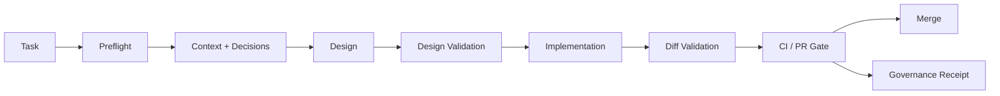

# Axiom — Engineering Governance Plane

**Status:** Product & system design package  
**Purpose:** Vendor-neutral engineering governance for organizations using multiple AI coding harnesses across many repositories.

Axiom makes architecture decisions, engineering invariants, system goals, standards, exceptions, and software topology queryable and enforceable by both humans and AI coding agents.

The core promise is simple:

> Before an AI agent plans, designs, edits, or merges a meaningful change, it must know the applicable engineering decisions, detect conflicts with existing architecture, and produce evidence that the change stayed within the organization's approved boundaries.

## Why Axiom exists

Organizations adopting Claude Code, Codex, Cursor, Kiro, Copilot, and other agentic coding systems gain enormous implementation throughput but also create a new governance problem: architectural decisions are made faster than humans can notice them, and each repository/harness can drift in a different direction.

Axiom treats **architecture decisions as executable organizational state**, not passive documentation.

## Product shape

Axiom consists of:

- **Governance Repository** — authoritative versioned decisions, standards, principles, exceptions, system goals, and ownership.
- **System Graph** — organization → domain → system → component → repository/API/resource/dependency topology.
- **Decision Resolver** — deterministic scope and precedence engine.
- **Policy Engine** — executable rules for machine-verifiable invariants.
- **Semantic Conflict Analyzer** — LLM-assisted detection for conflicts that cannot be expressed deterministically.
- **Governance MCP Server** — vendor-neutral tools for coding agents.
- **REST/Event APIs** — integrations with portals, CI/CD, catalog systems, and automation.
- **Harness Adapters & Hooks** — enforce preflight/design/diff checks in Kiro, Claude Code, Codex, Cursor, Copilot, and future harnesses.
- **CI/PR Gate** — independent final verification; agent compliance is never trusted by itself.
- **Governance UI** — search, browse, review, approve, supersede, grant exceptions, and inspect audit receipts.

## Golden workflow

A meaningful change follows:

1. Agent calls `governance.preflight_change`.
2. Axiom resolves affected systems/components and applicable decisions.
3. Agent produces a design referencing decision IDs.
4. Axiom validates the design.
5. Agent implements within the approved scope.
6. Axiom validates the resulting diff.
7. CI reruns deterministic checks independently.
8. Merge records a governance receipt tied to the decision snapshot.

## Design principles

1. **Authoritative before inferred.** Accepted decisions beat repository pattern inference.
2. **Deterministic before semantic.** If a rule can be checked mechanically, do not spend an LLM call on it.
3. **Map, not manual.** Harness-local instruction files are small bootstraps; central governance remains the source of truth.
4. **Fail closed on unresolved authority conflicts.**
5. **Humans approve organizational state.** AI may propose decisions but cannot silently make them authoritative.
6. **Exceptions are scoped, explicit, auditable, and expiring.**
7. **Vendor neutrality.** Governance survives replacement of any coding harness/model.
8. **Evidence over trust.** Every approval is reproducible from versioned inputs and rule results.
9. **Progressive enforcement.** Observe → warn → require review → block.
10. **No giant context dump.** Scope first; retrieve only applicable context.

## Package map

- `.kiro/` — Kiro-style steering and full Spec artifacts.
- `docs/01-product/` — product strategy, PRD, personas, vocabulary.
- `docs/02-architecture/` — architecture, graph, resolver, security, operations.
- `docs/03-governance/` — lifecycle, enforcement, exceptions, ownership.
- `docs/04-contracts/` — MCP, REST, event contracts.
- `docs/05-workflows/` — end-to-end operational workflows.
- `docs/06-delivery/` — roadmap, backlog, testing, adoption.
- `docs/07-decisions/` — ADRs for Axiom itself.
- `schemas/` — canonical machine-readable governance schemas.
- `examples/` — sample decisions, exception, repo bootstrap, hooks, CI integration.
- `references/` — external research sources and design influences.

## Recommended implementation baseline

This design is technology-neutral at the contract level. A pragmatic reference implementation is:

- ASP.NET Core / .NET 10 for API, resolver, policy orchestration, MCP host
- PostgreSQL + pgvector for projections, topology, full-text/vector retrieval, audit metadata
- Git as the authoritative governance source
- Vue 3 + TypeScript for governance portal
- OpenTelemetry for traces/metrics/logs
- Optional Redis for ephemeral cache/rate limiting
- Containerized rule runners for untrusted/custom policy execution
- Optional Backstage adapter rather than requiring Backstage

See `.kiro/specs/axiom/design.md` for the canonical design.
