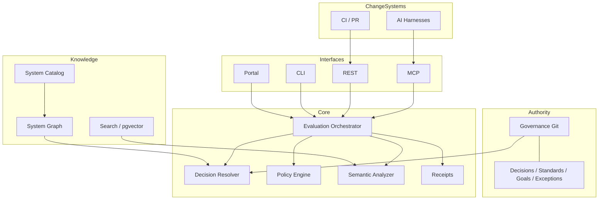

# Architecture at a Glance

```mermaid
flowchart TB
  subgraph Authority
    GG[Governance Git]
    DR[Decisions / Standards / Goals / Exceptions]
    GG --- DR
  end

  subgraph Knowledge
    CAT[System Catalog]
    SG[System Graph]
    IDX[Search / pgvector]
    CAT --> SG
  end

  subgraph Core
    RES[Decision Resolver]
    PE[Policy Engine]
    SA[Semantic Analyzer]
    EV[Evaluation Orchestrator]
    REC[Receipts]
    EV --> RES
    EV --> PE
    EV --> SA
    EV --> REC
  end

  subgraph Interfaces
    MCP[MCP]
    REST[REST]
    CLI[CLI]
    UI[Portal]
  end

  subgraph ChangeSystems
    AG[AI Harnesses]
    CI[CI / PR]
  end

  GG --> RES
  SG --> RES
  IDX --> SA
  MCP --> EV
  REST --> EV
  CLI --> EV
  UI --> EV
  AG --> MCP
  CI --> REST
```

**Key rule:** the LLM is never the source of organizational authority.
