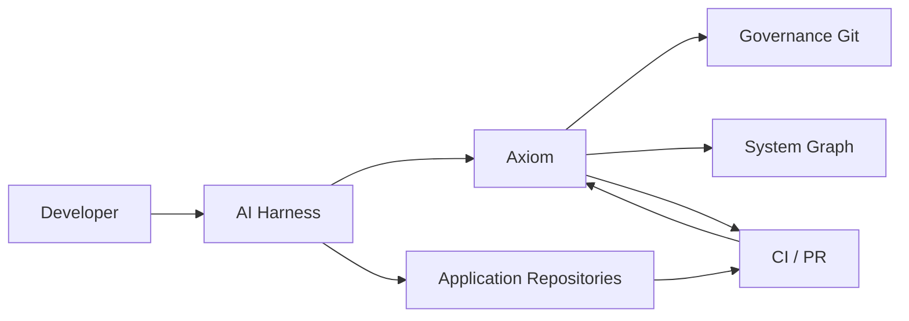

# Architecture — Context and Containers

## Context

Axiom is not in the source-code execution path of production applications. It is in the **engineering change path**.

This placement is intentional:
- production runtime does not depend on Axiom availability;
- governance can be strict at engineering boundaries;
- CI provides a second independent enforcement point.

## Containers

### 1. API + MCP Gateway
Stateless transport and auth edge.

### 2. Evaluation Service
Coordinates preflight/design/diff/PR evaluations.

### 3. Governance Registry
Indexes and validates version-controlled authority.

### 4. System Graph
Maps software topology and ownership.

### 5. Policy Engine
Executes deterministic checks.

### 6. Semantic Analyzer
Performs evidence-bounded LLM evaluation.

### 7. Sync Workers
Consume SCM/catalog changes and rebuild projections.

### 8. Portal
Human exploration, review, approvals, exception management.

### 9. PostgreSQL
Runtime projections, topology, audit metadata, vectors.

### 10. Policy Runner
Optional isolated runtime for organization-provided executable checks.

## Why modular monolith first

The modules are logically separable but do not initially require network boundaries. The evaluation path benefits from low latency and transactional consistency. Split services only when:
- policy execution requires hard isolation;
- semantic jobs require independent scaling;
- separate teams own modules;
- ingestion workloads materially interfere with interactive traffic.
