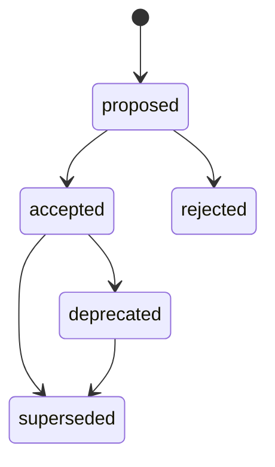

# Decision Lifecycle

## States

## Proposed
May be generated by human or AI. Searchable, but does not govern.

## Accepted
Authoritative within declared scope and validity.

## Deprecated
Still historically valid but discouraged for new decisions. Whether it continues to govern existing code is explicit in metadata.

## Superseded
Replaced by named record(s). Historical only for new evaluations unless replaying an old receipt/snapshot.

## Rejected
Retained for learning/history but never governs.

## Approval

Acceptance requires:
- owner;
- designated approver(s);
- valid schema;
- no unresolved hard conflict;
- rationale;
- scope;
- effective date;
- enforcement classification.

High-risk domains may require multiple approvals.

## Review/freshness

Every accepted record SHOULD have:
- `reviewAfter`;
- owner;
- last meaningful validation.

Staleness does not automatically invalidate authority. It raises a governance-health issue because silently dropping a stale decision can be worse.

## Supersession

Superseding records must explicitly name what they replace and whether migration is:
- immediate;
- new-code-only;
- phased;
- date-bound.

Agents should receive both the new rule and migration status when existing code is in transition.
