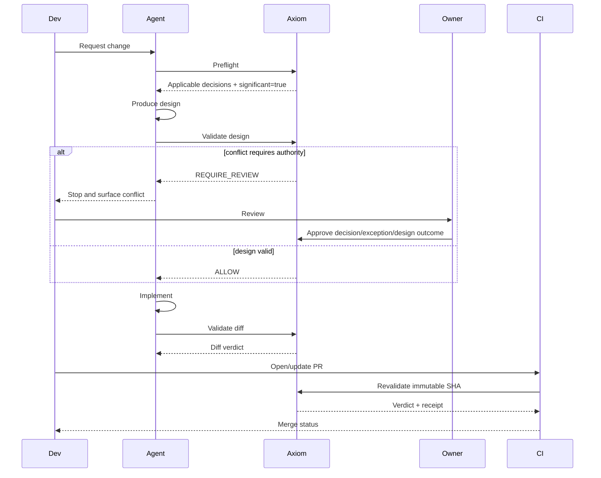

# Workflow — Preflight to Merge

## Standard significant change

## Rules

- Agent must not translate `REQUIRE_REVIEW` into “probably okay”.
- Design approval applies to a bounded scope and design hash.
- Actual diff can invalidate approval.
- CI uses commit SHA, not working-tree claims.
- The receipt is for the exact governed state and code revision.

## Trivial change fast path

Low-risk changes can:
- preflight automatically;
- skip formal design;
- run local/CI deterministic checks;
- merge if no governance escalation occurs.

Examples:
- typo/docs;
- local test-only change;
- implementation inside existing bounded pattern with no public contract/topology/security change.

The significant-change classifier is policy-driven.
