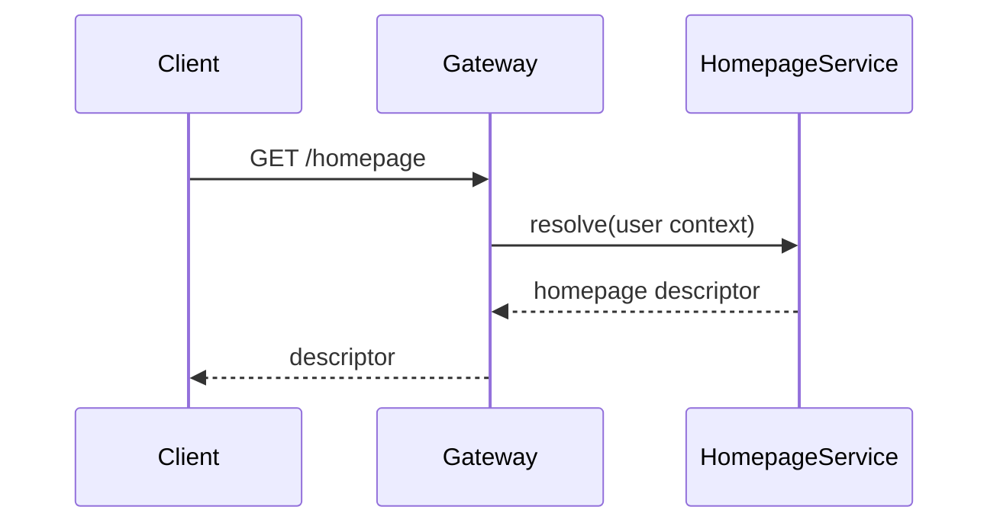

# DESIGN-101 — Homepage Routing Change

## Goal
Move role-specific homepage resolution out of the API Gateway and into Homepage Service.

## Non-goals
- Reworking authentication.
- Changing public client authentication contracts.

## Affected systems
- gui-platform

## Affected components/repositories
- api-gateway / gateway
- homepage-service / homepage-service

## Decisions consulted
- ARCH-042

## Current behavior
Legacy gateway code resolves some homepage state directly.

## Proposed behavior
Gateway forwards authenticated identity/context to Homepage Service. Homepage Service resolves role/person-specific homepage configuration.

## Data/control flow

## Failure modes
- Homepage Service unavailable → Gateway returns defined upstream failure/fallback contract; it does not recreate business logic.
- Stale cache → cache policy owned by Homepage Service.

## Security
Gateway forwards only required identity claims. Homepage Service authorizes resolution.

## Observability
Trace spans across Gateway → Homepage Service; metrics on resolution latency/errors.

## Rollout
Introduce service path behind a controlled flag; migrate clients; delete legacy implementation before EXC-023 expires.
